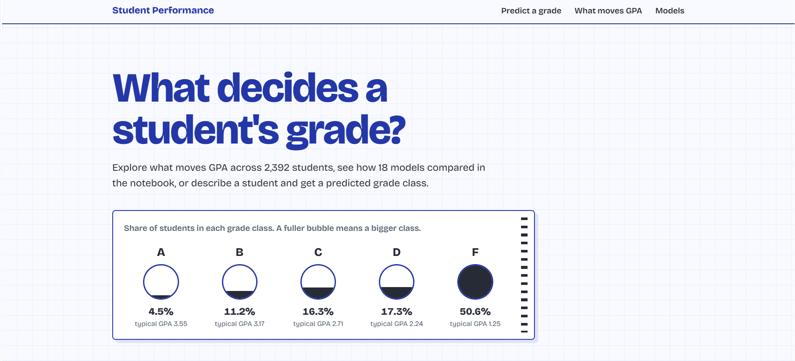
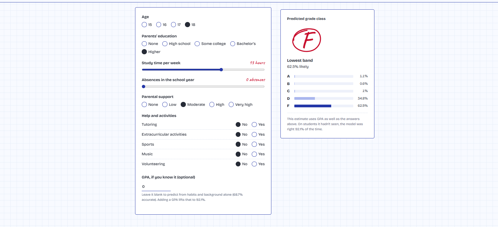
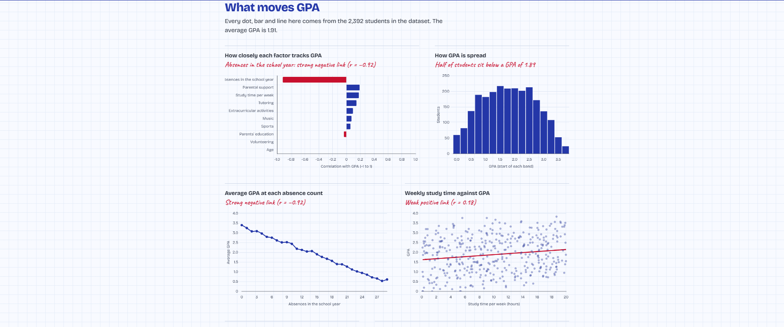
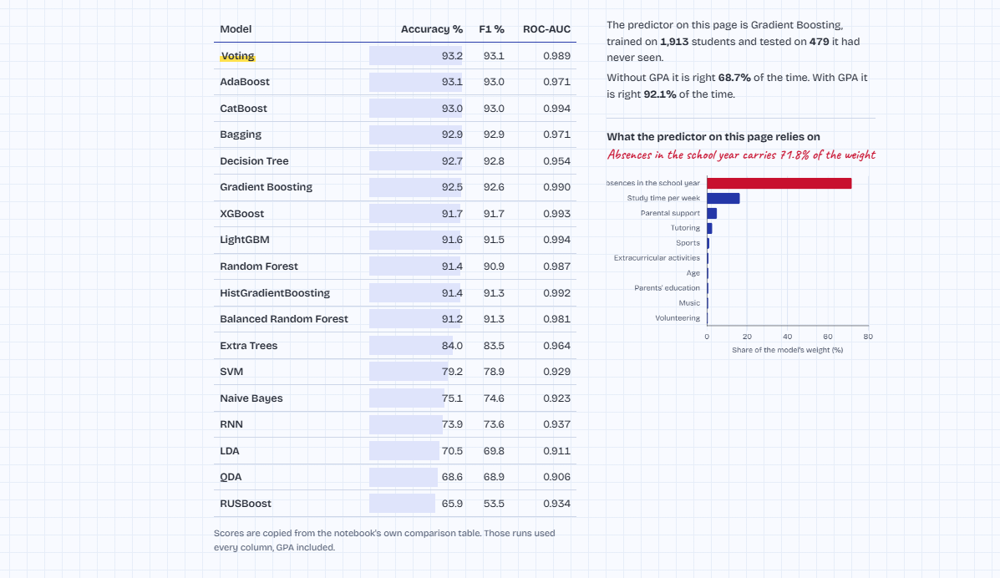

# Student Performance Analysis Using Machine Learning

## Project Overview

This project focuses on analyzing student-related data and predicting their **Grade Class** using a wide range of machine learning algorithms.

The dataset contains information about students such as **age, gender, ethnicity, study time, absences, tutoring, parental support, extracurricular activities, sports, volunteering, and GPA**.

Instead of relying on a single machine learning algorithm, this project evaluates multiple models on the same dataset to understand how differently they perform and which models are most suitable for predicting student performance.

The main focus of this project is **model comparison and evaluation**. Rather than comparing models only by accuracy, I also evaluate them using:

* Accuracy
* F1-score
* Sensitivity (Recall)
* Specificity
* ROC-AUC
* False Positive Rate (FPR)
* False Negative Rate (FNR)
* Confusion Matrix

This makes the comparison more informative and provides a better understanding of how each model handles different types of predictions.

---

## Dataset

The dataset was collected from **Kaggle** and contains student demographic, academic, and behavioral information.

### Main Features

* Age
* Gender
* Ethnicity
* Parental Education
* Study Time Weekly
* Absences
* Tutoring
* Parental Support
* Extracurricular Activities
* Sports
* Music
* Volunteering
* GPA
* Grade Class (Target)

The target variable is **Grade Class**, which represents the student's academic performance category.

---

## Project Workflow

The project follows a step-by-step machine learning workflow.

### 1. Data Collection

First, the dataset is loaded from Kaggle and prepared for analysis.

### 2. Initial Data Exploration

The dataset is explored using:

* First 5 rows
* Last 5 rows
* Dataset columns
* Dataset information
* Data types
* Statistical summary
* Dataset shape

This helps provide an initial understanding of the structure and characteristics of the dataset.

# Web View

